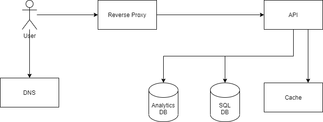

# fyi_hw

# Brief into

Design url shortener based on requirements [here](https://gist.github.com/stevecox/9e92eaa14f745e456bcf78b50835f7c5#project-2-backend-link-shortener).
This doc will approach architecture iteratively, will start with basic setup and after that's completed will explore more complex/scalable solutions.

## Intial Design

<p align="center">
  
  <br/>
</p>

### Base components

| Component         | Usage                                         | Description                                                                                                           |
|-------------------|-----------------------------------------------|-----------------------------------------------------------------------------------------------------------------------|
| API               | Provides all the endpoints                    | For basis setup we using any modern framework/language, I would personally write with either nestjs/flask.            |
| SQL Database      | Stores primary copy of urls; User information | Any common rational SQL engine would work here. I would favor Postgres via cloud provider.                            |
| Analytic Database | Stores statistics for visited urls            | For this we really need fast analytics database, for example AWS Redshift or if need self-hosted clickhouse; questdb. |
| Reverse Proxy     | Exposes api to public internet                | As we have single instance of backend server, only things that is needed ir reverse proxy.                            |
| Cache             | Caches generated urls                         | As traffic will mostly will contain READ requests we should cache to avoid hitting DB layer.                          |

### Endpoints
Endpoints will versioned using _URI-based_ schema for exampl `/api/v1/foo` where v1 respesents resources version.
#### create
```
ls -la 
```

#### retrieve
#### update
#### delete
#### info 


### Infra

If we are cloud providers, we could cloud managed solution for most of the services expect the backend api. This would allows bootstarp quickly serivces and focues on actual backend developement.


## Scaling design