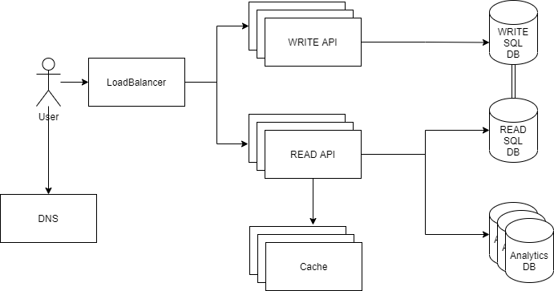

# Brief intro

Design url shortener based on requirements [here](https://gist.github.com/stevecox/9e92eaa14f745e456bcf78b50835f7c5#project-2-backend-link-shortener).
This doc will approach architecture iteratively, will start with basic setup and after that's completed will explore more complex/scalable solutions.

# Intial Design

<p align="center">
  
  <br/>
</p>

# Estimates
As this one-man project, most of the work will be focused on providing business value, code quality(design, tests). Infrastructure/deployment would be done on a basic level.
**To complete this task I'll need around 25 working days.**

| **Task**                    | **Date**                   |
|-----------------------------|----------------------------|
| App scaffold                | Jun 9,2021 - June 11,2021  |
| Endpoint POST "link"        | Jun 14,2021 - June 15,2021 |
| Endpoint GET "link"         | Jun 16,2021 - June 17,2021 |
| Endpoint UPDATE "link"      | Jun 18,2021 - June 21,2021 |
| Endpoint PATCH "link"       | Jun 22,2021 - June 23,2021 |
| Endpoint DELETE "link"      | Jun 24,2021 - June 25,2021 |
| Integrate with SQL Database | Jun 28,2021 - June 30,2021 |
| Integrate with Cache        | Jul 1,2021 - Jul 2,2021    |
| Public Holidays             | Jul 5,2021 - Jul 6,2021    |
| Integrate with Analytics DB | Jul 7,2021 - Jul 13,2021   |
| Deployment/Infra            | Jul 14,2021 - Jul 16,2021  |

<p align="center">
  
  <br/>
</p>


# Techonology

For a simple deployment/infra setup, we will AWS ECS, ECR, RDS, and Elastic Cache.
For ingress, we will Nginx + let's encrypt container with public IP
For services discovery, we will ECS service discovery
For deployment infra provisioning we will Terraform

<p align="center">
  
  <br/>
</p>


# Requirments

1. _The full URL provided by the customer (e.g. https://www.google.com) will always be shortened to an encoded value with our domain (e.g. https://lin.ks/xCd5a)_ 
2. _Shortened URLs must be unique for each customer. If two different customers create a short URL to the same destination (customer A and customer B both create short URLs to https://www.google.com), each customer is given a unique shortened URL._
3. _Duplicate shortened links for each customer are not allowed. If a customer attempts to create a new shortened link for a URL that already exists, the existing shortened link will be provided (e.g. a link for https://www.google.com already exists. Customer tries to create a new link to the same place, we return the existing short URL)._

While requirements specify CRUD based operation supports, I would suggest in this context  _UPDATE_ doesn't provide any useful to end-users, main reasons:
* link that is generated depends on input URL, any changes to it that would mean that we would have the different short URL link
* there no other input data in the context of the task, which means _UPDATE_ operation most likely is not needed, could be _CREATE/RETRIEVE/DELETE_

Requirements didn't specify error handling is task scope, so this skipped to save time.

To ensure that generated URL always the same for the user/URL combination - we can use a hash function that would take as input userId, and URL. To prevent creating duplicates we check if the generated URL hash is already in DB.
```typescript
async hashUrl(userId: int, url: string): string {
  const hash = new Hash({seed=userId.toString()}) // userId would be used as seed to ensure that same url would be used
  return hash.encode(url).substring(0,4)
}
```

# Workflow

### Creating shortened link

1. User sends data to _API_ endpoint
2. _Reverse Proxy_ forwards the request to _API_
3. _API_ parse request
   1. check if the URL is in _SQL Database_
      * if URL exist return existing _SQL Database_ record
   2. if URL doesn't exist create a new record in _SQL Database_
   3. _API_ return request with the response to  _Reverse Proxy_
4. _Reverse Proxy_ returns request to User

### Accessing shortened link

1. User open link in a browser
2. _API_ get request on the endpoint that contains id of shortened URL
3. _API_ queries _Cache_ if it contains the record of URL
   * if it's cache miss, _API_ queries _SQL Database_ and pushes record to _Cache_
4. If _Cache_ contains a record it's returned to the user
5. _API_ send access statistics to _Analytic Database_
6. _API_ forwards redirect the request to specified URL

# Base components

| **Component**       | **Usage**                                     | **Description**                                                                                                |
|---------------------|-----------------------------------------------|----------------------------------------------------------------------------------------------------------------|
| _API_               | Provides all the endpoints                    | For basis setup, we using any modern framework/language, I would personally write with either nestjs/flask.    |
| _SQL Database_      | Stores primary copy of URLs; User information | Any common rational SQL engine would work here. I would favor Postgres via cloud provider.                     |
| _Analytic Database_ | Stores statistics for visited URLs            | For this we need fast analytics database, for example, AWS Redshift or if need self-hosted Clickhouse; Questdb |
| _Reverse Proxy_     | Exposes API to public internet                | As we have a single instance of a backend server, only things that are needed in reverse proxy.                |
| _Cache_             | Caches generated URLs                         | As traffic will mostly contain READ requests we should cache to avoid hitting the DB layer.                    |

# Endpoints
Endpoints will be versioned using _URI-based_ schema for example `/api/v1/foo` where v1 represents resources version `1`.

## Create

`POST /v1/link`
```sh
curl https://api.lin.ks/v1/link \
  -X POST \
  -u $API_TOKEN \
  -d url="https://google.com"
```
Response:
```json
{
  "id": "ID",
  "link": "https://lin.ks/xCd5a",
  "url": "https://google.com"
}
```

## Retrieve
`GET /v1/link`
```sh
curl https://api.lin.ks/v1/link/:id \
  -u $API_TOKEN
```
Response:
```json
{
  "id": "ID",
  "link": "https://lin.ks/xCd5a",
  "url": "https://google.com"
}
```

## Update
`PATCH /v1/link`
```sh
curl -X PATCH https://api.lin.ks/v1/link/:id \
  -u $API_TOKEN \
  -d '{"url": "https://duckduckgo.com"}'
```
Response:
```json
{
  "id": "ID",
  "link": "https://lin.ks/xCd5a",
  "url": "https://google.com"
}
```


## Delete
`DELETE /v1/link`
```sh
curl -X DELETE https://api.lin.ks/v1/link/:id \
  -u $API_TOKEN \
```
Response:
```json
{
  "id": "ID",
  "status": "DELETED"
}
```

## Info 
`GET /v1/link/:id/info`
```sh
curl https://api.lin.ks/v1/link/:id \
  -u $API_TOKEN \
```
Response:
```json
{
  "id": "ID",
  "total_clicks": 30,
  "people_clicks": 4,
  "clicks_by_days": [
    {"date":1},
    {"date2":3},
    {"date3":1}
  ],
  "people_clicks_by_days": [
    {"date":1},
    {"date2":3},
    {"date3":1}
  ]
}
```

# Scaling design

To scale this system we could break out components by functionality. And which parts of the system they access.
Main changes:
* _API_ broken into read/write that can scale independently and has reduced access surface to other components
* _SQL Database_, _Cache_, _Analytics  Database_ run in cluster mode 

<p align="center">
  
  <br/>
</p>
